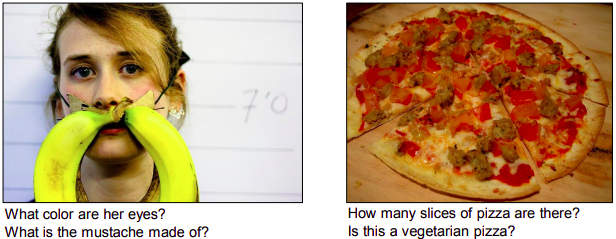
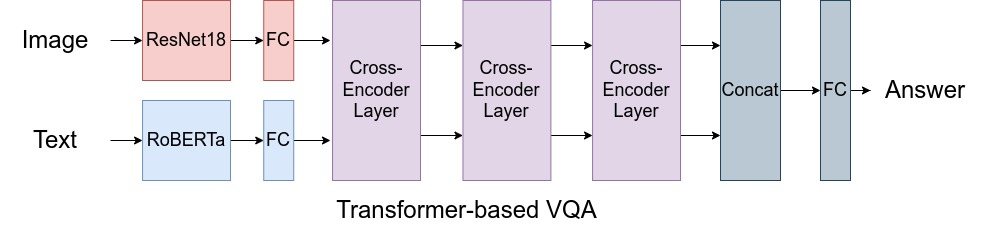
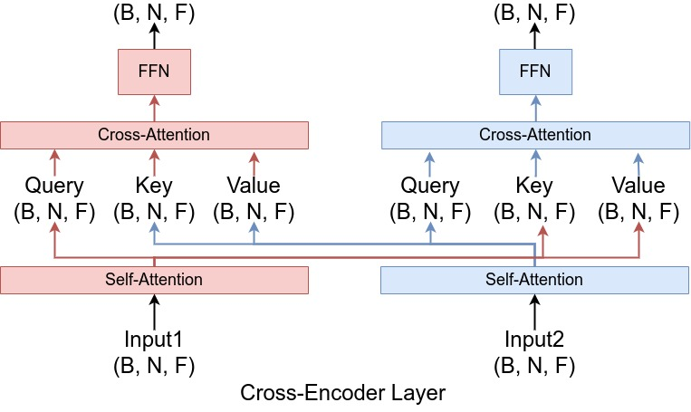
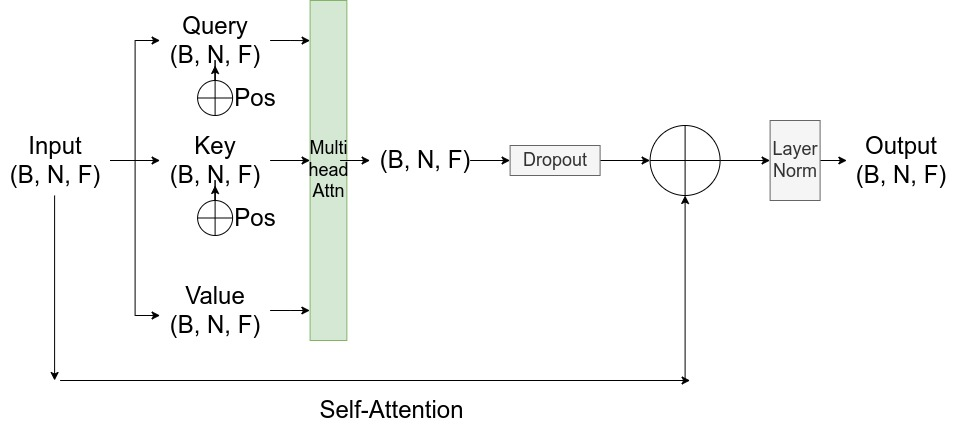
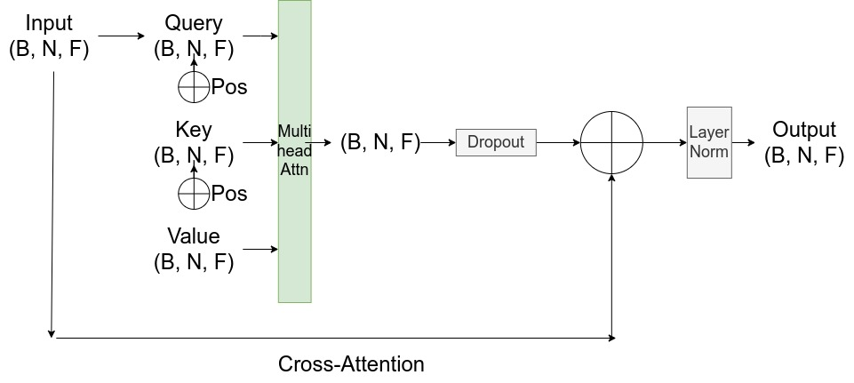
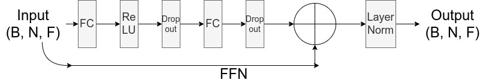

# Assignment 3: Visual Question Answering with PyTorch!

- [Visual Learning and Recognition (16-824) Fall 2022](https://visual-learning.cs.cmu.edu/index.html)
- TAs: [Nikos Gkanatsios](https://nickgkan.github.io/) and [Sai Shruthi Balaji](https://www.linkedin.com/in/sai-shruthi-balaji/).
- Please post questions, if any, on Piazza for HW3.
- Total points: 100 + 30 (bonus)
- Due Date: Nov 16, 2022 at 11:59pm EST.
- Enjoy!

While in the previous assignments we focused on image understanding (through object localization and generation), in this assignment we combine image and text understanding. Specifically, we address the task of Visual Question Answering (VQA) [1]: given an image and a question about it, our goal is to provide an answer to this question. While open-ended question answering would demand text generation, VQA is traditionally tackled as a classification problem; we select the answer out of a (large) pool of possible answers.



Our goal is to implement two such answer classifiers. First, we will implement a simple baseline model that featurizes the image and the question into 1-d vectors, then concatenates the two representations and feeds them to a linear layer to output a score for each possible answer. However, we will notice that such a late fusion of the two modalities (vision and language) does not allow for sufficient feature interaction and leads to poor results. We will try to quantify why. Lastly, we will implement a Transformer-based model that featurizes the two modalities into sequences, then applies iterative self-/cross-attention on them.


## Setup

You can use the conda environment we used for the object localization assignment (PyTorch 1.11). Make sure that at least your PyTorch version is 1.11 or newer.
Additionally install the libraries in ```requirements.txt```. For reference, we used torch 1.11.0, torchvision 0.12 and transformers==4.12.3, but different versions should work as well.

We provide you with a clean VQA Python API that i) works with Python 3, ii) has detailed docstrings on the methods you may need, iii) includes examples on how to use it (simply run ```python vqa_api.py``` and check the corresponding commands). Familiarizing yourself with this class will help in writing the dataset class later!

### Download dataset

Download the train and validation data: https://visualqa.org/vqa_v1_download.html (we only need 'Real Images', not 'Abstract Scenes'). We're using VQA v1.0 Open-Ended. You need the annotations, the questions and the images for both the training and validation sets.

Run ```DATA_PATH=path/to/your/data/folder/ ./download_data.sh``` to download and unzip everything.


## Task 1: Understanding VQA (20 points)
VQA is often addressed as a classification problem, where we map image-question pairs to a pool of predefined answers.

To create this pool of answers, a naive way is to collect all different answer strings of the training set and treat them as separate class. However, this creates a very long tail of classes and only makes the problem harder and the inference slower computationally. To account for this, we sort the answer by frequency and keep the 5216 most frequent ones (5216 is a hyperparameter used by the first VQA papers). To ensure fair pre-processing and filtering, we have included the code that sorts the answers and creates the answer-to-class map. We also include a 5217th class that corresponds to 'other'. All rare answers are mapped to 'other'. This makes VQA a 5217-way classification problem.

Based on the above description:

**1.1 Why do you think that it's computationally costly to use all answers as separate classes instead of keeping only the most frequent ones?**

**1.2 Complete the `__init__` method of the dataset class for VQA in `vqa_dataset.py`. Specifically, initialize the VQA API and anything you need from that.**

**1.3 Implement the `__len__` method of the `VQADataset` class. Should the size of the dataset be equal to the number of images, questions or the answers?**

**1.4 Complete the `__getitem__` method. You need to (1) figure out what is the `idx`-th item of the dataset; (2) load the question string.**
To make sure that your results are comparable to the TAs' (and your peers') implementation, we have included the image preprocessing function. The `__getitem__` method returns the question and list of answers, the preprocessed (normalized) image as well as the original image for visualization purposes.

Additionally, the VQA dataset contains 10 answers per question. These are usually synonyms/paraphrases (or 'other', if they're very rare). Our dataset class considers all of them and returns a binary vector indicating the validity of each answer (field `answers`).


## Task 2: Building a pipeline for VQA (50 points)
To build a learning pipeline we need i) a dataset class (we have already built it!), ii) a model that absorbs the data and returns some predictions, iii) a training pipeline that optimizes these predictions and iv) metrics that evaluate the predictions.

### Model
As you've already figured out, a VQA model for this assignment is simply a classifier over 5217 classes. The first baseline is very simple. We featurize the image using a frozen pre-trained ResNet18. For that, we feed the image to ResNet18 except for the last layer which gives the classification logits. This gives us an 1-d feature vector for the image. We also featurize the question into an 1-d vector using a frozen pre-trained RoBERTa, a Transformer-based language model. Finally, we concatenate the two representations and feed to a linear layer. The parameters of this linear layer are trainable. The code for loading the pre-trained models is given. The forward pass of the language model is also given.

Based on the above description:

**2.1 What should be the output dimension of the trainable linear layer? Complete the corresponding part in the `__init__` method of `BaselineNet` in `models.py`.**
    
**2.2 Implement `compute_vis_feats` that featurizes the image (it can be implemented as an one-liner!).**

**2.3 Implement the forward pass of `BaselineNet`.** Make sure to use `compute_vis_feats` and `compute_text_feats`.

### Training loop
We provide skeleton code in `main.py`. We use Adam optimizer, although you can experiment with different optimizers and hyperparameter values. As mentioned earlier, the VQA dataset contains 10 synonym/paraphrased/duplicate answers per question. A standard softmax classification would create competition among such answers. To avoid that, we treat all of them as correct.

**2.4 What is the loss for multi-label classification?** (Hint: in HW1 you also tackled a multi-class classification problem)

**2.5 Implement the loss call and the optimization code in the `train_test_loop` method.**

### Evaluation
The prediction is considered accurate if the most confident answer is correct, i.e. if it is one of the multiple correct answers. We provide the code to compute accuracy.

**2.6 Complete the `train_test_loop` method to monitor the performance in Tensorboard. Plot the loss and accuracy and include these in your report. Additionally show multiple image-question pairs (at least 3) with the respective answers (predicted and ground-truth).** For the image-question pairs, just show results from your best model, not at intermediate epochs. If an image-question pair has more than one ground-truth answers, randomly select one to show.

Now, we are ready to train/test the model! Aim for a validation accuracy of 50%, but anything above 45% is fine. For reference, the TAs were able to get 52% accuracy with the defaults hyperparameters in 10 epochs. You're free to use different hyperparameters but not to change the architecture at this point.

### Analysis
We want to get an idea of why our performance is so low. You may already have an idea actually from what you visualized.

**2.7 Make a histogram of the frequencies of the predicted answers (all 5217) without labels.** Specifically, gather all the predicted answers of your model through the whole dataset. For each sample, keep only the argmax (most confident) prediction. Then compute the frequency of each predicted answer, sort in decreasing order of frequency and plot the histogram. You can use matplotlib to do this. For reference, the TAs used `pyplot.bar`.

**2.8 What are the 10 most frequently predicted classes? Why do you think this happens? You can optionally visualize the frequency of ground-truth answers in the training set.**

Take-away message: when your network is not expressive enough to capture the causal factors of your data, it will try to capture the output distribution. Representing the true data distribution rather than the label one is an important and open problem in Machine Learning!


## Task 3: Transformer Network (30 points)
The baseline model has obvious limitations: it condenses the whole image (question) into an 1-d vector and there's no interaction between the visual and textual features. We are now going to enhance this model with attention layers, using Transformers.

Here is the model we are going to implement:



After encoding each modality separately and projecting them to have the same feature dimension, we apply three cross-encoding layers.
The refined visual/text features are then mean pooled, concatenated and fed to a linear layer that predict confidence scores over the possible answers. This pipeline is already implemented in `models.py` as `TransformerNet`. However, the cross-encoder layer is not implemented.

A high-level diagram of the cross-encoder layer can be seen here:



We are going to implement this layer step-by-step (see TODOs in `models.py`).

First, the self-attention layer allows interaction among the different tokens of a single modality:



Next, the cross-attention layer allows interaction among different modalities:



Pay attention to the query/key/value now as they come from different modality!

Lastly, the feed-fordard network is just an MLP (see code for exact dimensions):



Keep in mind that the input to and the output of a cross-encoder layer have identical shape.

For the visual stream we also use positional embeddings to denote the position of each patch. This is a generalization of the embeddings introduced in "Attention is all you Need" for images. We have implemented this part for you, so you don't need to (and should not) alter it.

Once you implement the TODOs, [download](https://drive.google.com/file/d/1NOfqxcde2TXwVDVJ3sp-QwKkZ2S_2oTE/view?usp=sharing) the trained weights (by TAs) and run ```python main.py --model transformer --eval```. You should get an accuracy of 67.62%. To download the weights you need to use your CMU account.

**3.1 Complete the `CrossAttentionLayer`.** Include a screenshot of the `forward` method in your report.

Hints: do not change any layer's name. The current `__init__` method contains the names of all layers that you will need. We've implemented one of the self-attention layers for reference. Build the others based on that and the comments. `nn.MultiheadAttention` directly implements multi-head attention. Make sure to initialize it and call it with appropriate arguments. This is a common source of bugs.

**3.2 Load the trained weights and reproduce our result.** This will be tested via an automated Gradescope grader that will try to reproduce our result using your model class.

**3.3 How does the histogram of answers look now?**

Take-away message: the success of a representation model highly depends on the distributional properties of the data and the labels. A non-expressive model learns the biases of the frequent classes. An expressive model can learn more accurate classifiers for the frequent classes but is still biased towards them. In such cases, more careful loss design is required.


## Task 4: Bells and Whistles  (30 bonus points)

**4.1 Is it a matter of capacity? In the `BaselineNet` replace the linear classifier with a deeper MLP. Report the accuracy plot of this model.**

**4.2 Is it a matter of context? Featurize the image with ResNet18 and pool an 1-d representation. Then use this vector to condition (provide it as initial hidden state) an LSTM that reads the language word-by-word. Gather the hidden representations of this LSTM and classify the answer.**

**4.3 Better than 67.62? Try to improve the Transformer-based model. Some ideas include adding more encoder layers or (partially) unfreezing the backbones' weights. Note that this can take significant amount of GPU time.**

**4.4 Propose and implement any other idea you have!** This does not have to include implementing/training a new model. It can be an interesting analysis or a better loss.


## Relevant papers:
[1] VQA: Visual Question Answering (Agrawal et al, 2016): https://arxiv.org/pdf/1505.00468v6.pdf

[2] Making the V in VQA Matter: Elevating the Role of Image Understanding in Visual Question Answering (Goyal, Khot et al, 2017):  https://arxiv.org/pdf/1612.00837.pdf


## Submission Checklist 
### Report

Briefly describe what you did and anything that you found particularly interesting. Include your answers to all questions above (theory questions, images, plots, comments).

### Grading

Each question in tasks 1 and 2 counts for 5 points. You get the 10 remaining points for task 2 if you achieve the expected performance. Each question in task 3 is worth 10 points. You can get up to 15 points for each bonus question, but only up to 30 bonus points in total.

